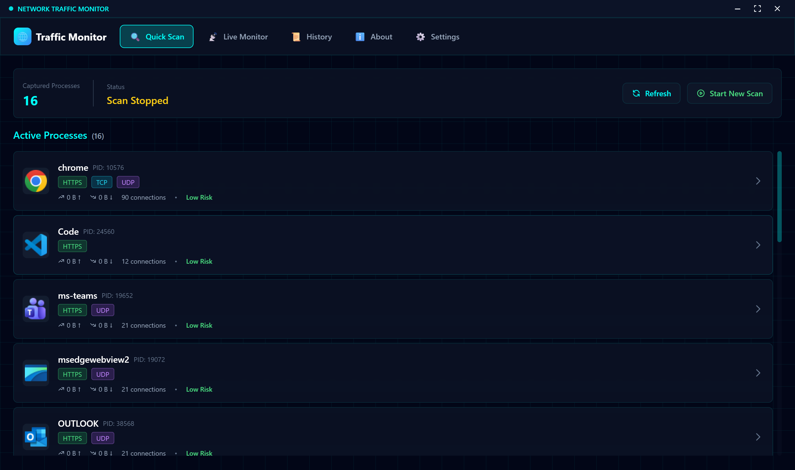
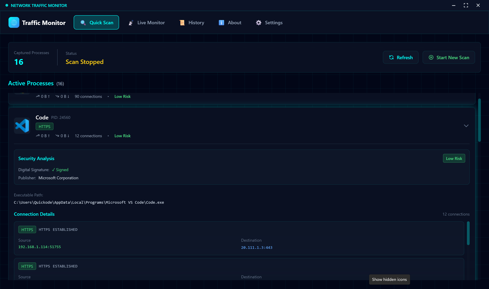

# 🌐 Network Traffic Monitor

> Because wondering "what the heck is eating my bandwidth?" at 3 AM is a universal experience.

A futuristic-looking network traffic monitor that lets you spy on (your own) apps and see exactly where they're phoning home. Built with Electron, React, and C# because apparently I enjoy suffering.


## 🎯 What Does This Thing Do?

Ever wondered which apps are secretly sending your cat photos to the cloud? Or why your computer sounds like a jet engine when you're "just browsing"? This tool helps you answer those burning questions by:

- **Scanning network activity** - See every app making connections in real-time
- **Live monitoring** - Like a security camera for your network traffic (updates every 5 seconds)
- **Security analysis** - Tells you if an app is digitally signed or if it's running from your temp folder like a suspicious character
- **DNS resolution** - Shows actual domain names instead of cryptic IP addresses
- **Risk assessment** - Rates apps from "chill" to "yikes" based on behavior patterns
- **Export to CSV** - Because spreadsheets never go out of style

### Screen shots
## quick scan

## app details and risk assessment


## 🏗️ Architecture (The Spicy Technical Bits)

### The Players

**Frontend (Electron + React + TypeScript)**
- Lives in: `app/`
- Job: Looking pretty and showing you stuff
- Tech: Electron 40, React 18, Vite, TailwindCSS
- Aesthetic: Cyberpunk glassmorphism with neon cyan accents (yes, really)
- Runs as: Regular user (no admin needed on this side)

**Backend (C# .NET 8.0)**
- Lives in: `backend/CaptureService/`
- Job: The heavy lifting and actual network inspection
- Tech: SharpPcap for packet capture, Windows IP Helper API for connection details
- Runs as: Administrator (because Windows won't let peasants see network stuff)
- Communication: TCP on localhost:9876 (fancy, I know)

### How They Talk

```
Frontend (you)  <--TCP Socket (JSON)-->  Backend Service (admin)
    ^                                            |
    |                                            v
    └───────── "Hey, what's connected?" ─────────┘
                                                 |
                                                 v
                                    ┌───────────────────────┐
                                    │ Windows Network APIs  │
                                    │ (TCP/UDP tables)      │
                                    └───────────────────────┘
```

The frontend asks nicely, the backend (running with elevated privileges) talks to Windows, and they exchange JSON over a local TCP connection. It's like a very boring spy movie.

### Key Features Under the Hood

- **SharpPcap**: For actual packet sniffing (when available)
- **Windows IP Helper API**: GetExtendedTcpTable/GetExtendedUdpTable for connection details
- **Digital Signature Verification**: Uses X509Certificate to check if executables are signed
- **Async DNS Resolution**: 500ms timeout so slow DNS servers don't freeze the UI
- **Thread-Safe Caching**: ConcurrentDictionary because race conditions are scary
- **Service Name Mapping**: 80+ common ports identified (HTTP, HTTPS, SSH, RDP, etc.)
- **Risk Scoring System**: Weighs factors like unsigned executables, temp folder locations, and connection patterns

## 🚀 Running This Beast

### Prerequisites

- **Windows 10/11** (because we're using Windows-specific APIs)
- **Node.js 18+** (for the frontend)
- **.NET 8.0 SDK** (for the backend)
- **Administrator privileges** (the backend service needs this)
- **Coffee** (optional but recommended)

### Backend Setup

1. Navigate to the backend folder:
```powershell
cd backend\CaptureService
```

2. Build it:
```powershell
dotnet build -c Release
```

3. Run it as admin (this will pop up a UAC prompt):
```powershell
Start-Process powershell -ArgumentList "-NoExit", "-Command", "cd '$PWD'; dotnet run -c Release" -Verb RunAs
```

You should see:
```
🚀 Network Capture Service started
📡 TCP Server listening on localhost:9876
```

Keep this window open. If it closes, the app won't work (obviously).

### Frontend Setup

In a **different** terminal (regular user, no admin needed):

1. Go to the app folder:
```powershell
cd app
```

2. Install dependencies (first time only):
```powershell
npm install
```

3. Run the dev server:
```powershell
npm run dev
```

The Electron app should launch automatically. If not, check if:
- The backend is running (see above)
- Port 9876 isn't being used by something else
- Your antivirus isn't being overly protective

## 🎮 Using The App

### Quick Scan
Click the big shiny "START SCAN" button. Watch as apps with active connections appear. Click any process to see detailed connection info, security analysis, and more.

### Live Monitor
Switch to the "Live Monitor" tab and hit "Start Live Monitor". It'll scan every 5 seconds and show you NEW apps that weren't in the previous scan. Great for catching sneaky background processes.

### Security Risk Levels

- **Low Risk**: Digitally signed by Microsoft/Google/etc, normal behavior
- **Medium Risk**: Unsigned or mildly suspicious patterns
- **High Risk**: Unsigned + running from temp folder + 50 connections = 🚩

### Settings

- **Theme Toggle**: Switch between dark and light mode (dark mode is objectively superior but I won't judge)
- **Export to CSV**: Download all your scan history for Excel adventures

## 🐛 Known Issues / Quirks

- **"Why don't I see all Chrome tabs?"** - Modern browsers use HTTP/2 and connection pooling. Multiple tabs to the same site share one TCP connection. Physics, not bugs.
- **"Some hostnames show as IPs"** - DNS resolution has a 500ms timeout. If it's slow or the IP has no reverse DNS, you get the raw IP.
- **"The app needs admin?"** - Only the backend. Windows locks down network APIs harder than Fort Knox.
- **"Risk level seems harsh"** - Better safe than sorry. Review the security warnings to understand why.

## 📁 Project Structure

```
internet-outgoing/
├── app/                          # Electron frontend
│   ├── src/
│   │   ├── main/                 # Electron main process
│   │   │   └── main.ts           # IPC handlers, backend connection
│   │   ├── preload/              # Preload scripts
│   │   └── renderer/             # React UI
│   │       ├── src/
│   │       │   ├── components/   # UI components
│   │       │   │   ├── About.tsx
│   │       │   │   ├── LiveScan.tsx
│   │       │   │   ├── Navigation.tsx
│   │       │   │   ├── ProcessList.tsx
│   │       │   │   ├── ScanHistory.tsx
│   │       │   │   ├── Settings.tsx
│   │       │   │   └── TitleBar.tsx
│   │       │   ├── styles/       # CSS (dark/light themes)
│   │       │   ├── types/        # TypeScript interfaces
│   │       │   └── App.tsx       # Main app component
│   └── package.json
│
└── backend/                      # C# .NET backend
    └── CaptureService/
        ├── CaptureEngine.cs      # SharpPcap wrapper
        ├── ProcessHelper.cs      # Connection detection, security analysis
        ├── PipeServer.cs         # TCP server (yes, bad naming)
        ├── Program.cs            # Entry point, admin check
        └── CaptureService.csproj
```

## 🛠️ Building for Production

### Frontend
```powershell
cd app
npm run build
```

Creates a portable executable in `app/dist/`.

### Backend
```powershell
cd backend\CaptureService
dotnet publish -c Release
```

Output in `backend\CaptureService\bin\Release\net8.0\publish\`.

## 🤝 Contributing

Found a bug? Want to add a feature? PRs welcome! Just:
1. Don't break the build
2. Keep the neon cyan aesthetic (it's non-negotiable)
3. Add comments if your code is clever
4. Test on Windows (this ain't cross-platform, friend)

## ⚠️ Disclaimer

This tool requires admin privileges and inspects network traffic. Use responsibly:
- ✅ Monitoring your own computer
- ✅ Debugging network issues
- ✅ Learning about network activity
- ❌ Monitoring other people's computers without permission
- ❌ Doing anything illegal

I'm not your lawyer, but I'm pretty sure hacking is frowned upon in most jurisdictions.

## 📝 License

MIT - Do whatever you want, just don't blame me if something breaks.

## 🙏 Acknowledgments

- **SharpPcap** - For making packet capture less painful
- **Electron** - For making desktop apps with web tech (controversial but here we are)
- **Coffee** - The real MVP
- **Stack Overflow** - You know why

## 💬 Questions?

Open an issue, send a PR, or yell into the void. One of those might work.

---

Built with 💙, ☕, and a concerning amount of neon cyan.
